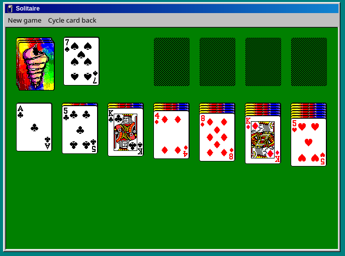

# JavaScript Solitaire Game

Based on https://github.com/rjanjic/js-solitaire
Did some modifications and package upgrades.
Sprite sheet from https://github.com/1j01/98

DEV env: `yarn && yarn start`

Production build: `yarn build`

[Demo](https://quedlin.github.io/js-solitaire-demo/)